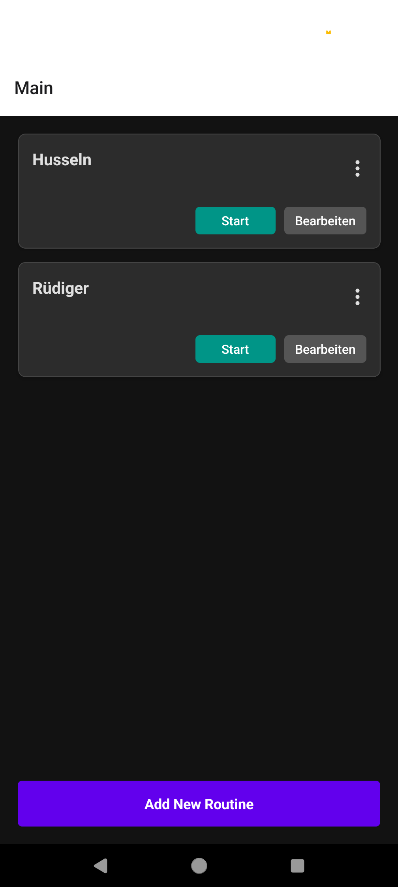
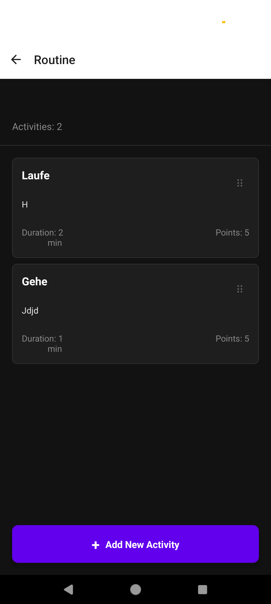
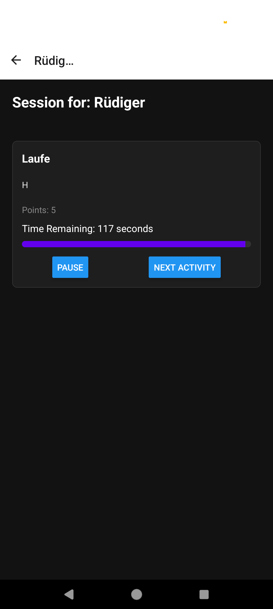

# ADHD-Routine-App-Dorro

ADHD-Routine-App-Dorro is a mobile application designed to help users manage their routines and activities efficiently. The app allows users to log in, create routines, and run sessions.

## Table of Contents

- [Features](#features)
- [Installation](#installation)
- [Usage](#usage)
- [Screenshots](#screenshots)
- [Contact](#contact)

## Features

- User authentication (Login and Signup)
- Create and manage routines
- Add activities within routines
- Run Routine Sessions
- User-friendly interface with a modern design

## Installation

To get started with the project, follow these steps:

1. Clone the repository:
   ```bash
   git clone https://github.com/LucaGS/ADHD-Routine-App-Dorro-Frontend.git
   ```

2. Navigate into the project directory:
   ```bash
   cd ADHD-Routine-App-Dorro-Frontend
   ```

3. Install the dependencies:
   ```bash
   npm install
   ```

4. Start the application:
   ```bash
   npm start
   ```
4. Connect device:
  follow console instructions

## Usage

After starting the application, you can navigate through the following screens:

- **Welcome Screen**: Introduction to the app, can navigate to .
- **Login Screen**: Users can log in to their accounts.
- **Signup Screen**: New users can create an account.
- **Main Screen**: Users can view and manage their routines.
- **Routine Screen**: Detailed view of a specific routine and its activities.

## Screenshots






## Contact

Your Name - Luca Stieme
E-mail - luca.stieme@outlook.de


